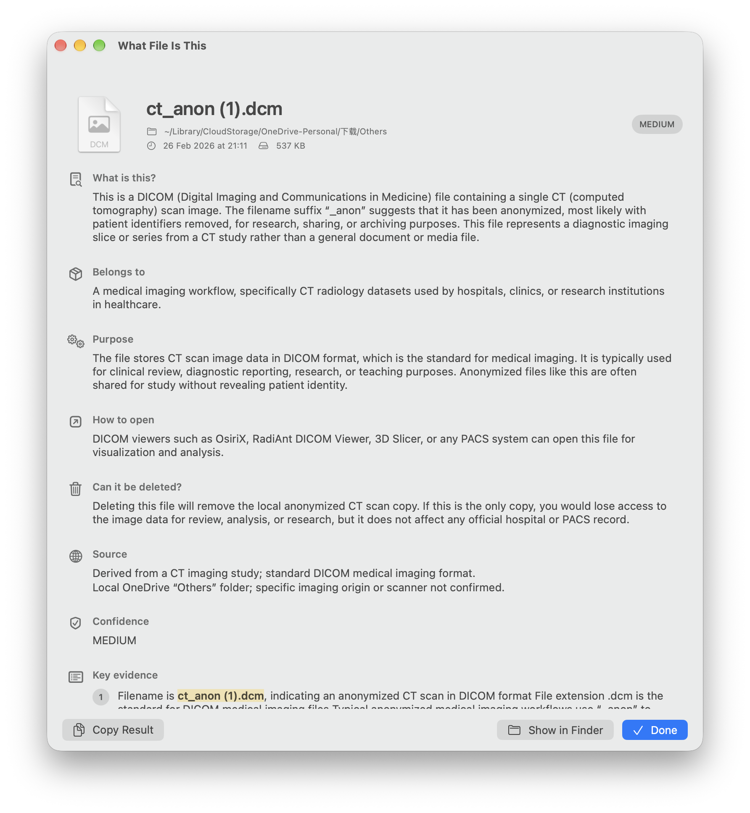
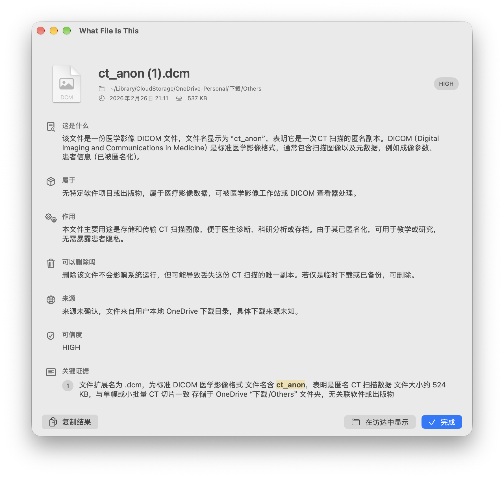
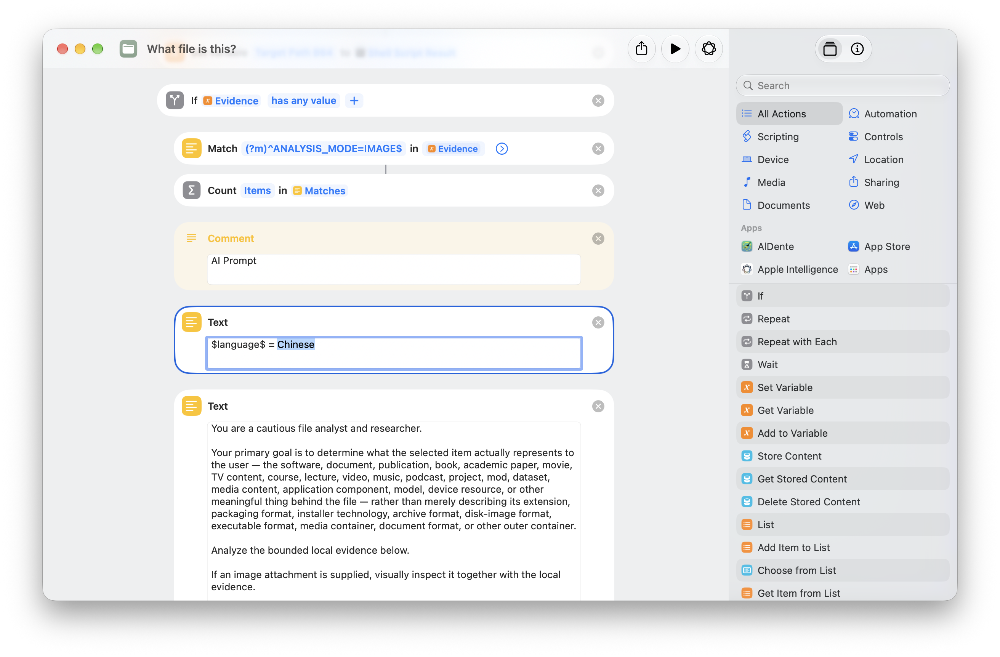

# What File Is This

[简体中文](README.zh-CN.md)

**What File Is This** helps you understand an unfamiliar file directly from Finder. Select a file or folder, run the supplied Shortcut, and receive a plain-language explanation of what it is, what it may belong to, how it can be opened, whether deletion is risky, and the evidence behind the answer.

It is useful for unfamiliar downloads, project files, archives, media sidecars, research material, medical-image samples, and many other file types. It does not change the selected item.





## Install

1. Download `What File Is This.dmg` from the release.
2. Open it and drag **What File Is This** to **Applications**.
3. Open the app once. If macOS asks for confirmation, choose **Open**.
4. Import `What file is this?.shortcut` into the Shortcuts app.

The app requires macOS 27 or later.

## Use it from Finder

1. Select one file or folder in Finder.
2. Control-click it, choose **Quick Actions**, then choose **What file is this?**.
3. A result window appears immediately while the Shortcut prepares the analysis.
4. Read the result, copy it, reveal the original item in Finder, or close the window when finished.

Each run has its own result window. Closing the final window quits the app.

## Change language settings

### App interface

Choose **What File Is This → Settings… → Language**, then select **English** or **简体中文**. Quit and reopen the app to apply the selection everywhere, including standard macOS menus.

### Analysis response

The Shortcut has an editable language value near the start of its analysis prompt. Open the Shortcut in Shortcuts, find the Text action that reads `$language$ = Chinese`, and replace `Chinese` with the response language you want.



## Privacy and care

- The app displays received results locally and does not modify the selected file.
- The Shortcut gathers bounded local evidence and performs the analysis. Review its actions before using it on sensitive material.
- Results are informational. In particular, do not treat medical, legal, security, or deletion guidance as a substitute for professional review or a backup.

## Build and release notes

The project is a native SwiftUI/AppKit macOS application. The Finder Shortcut launches a loading window through the `whatfileisthis` URL scheme and sends its finished analysis through a local, user-private Unix-domain socket. The result is held in memory; no `.wfitresult` bridge file is created.

### Build from source

```bash
swift build -c release
./Build\ \&\ Install.command
```

`Build & Install.command` creates `build/What File Is This.app`, installs it in `~/Applications`, registers its URL scheme, and signs the local bundle ad hoc.

### Create the DMG

This repository uses the companion [Dmg Maker](../Dmg%20Maker) project and its existing background artwork. From this repository:

```bash
mkdir -p dist
cd dist
../../Dmg\ Maker/dmg.sh ../build/What\ File\ Is\ This.app ../../Dmg\ Maker/Background.png
```

The resulting `What File Is This.dmg` is written to `dist/`.

### Development details

- App source: `Sources/WhatFileIsThis/`
- Shortcut sample/result parser: `Samples/Example.wfitresult` and `ResultParser.swift`
- Direct result transport: `/private/tmp/what-file-is-this-<uid>.sock`
- Supported application localizations: English and Simplified Chinese
